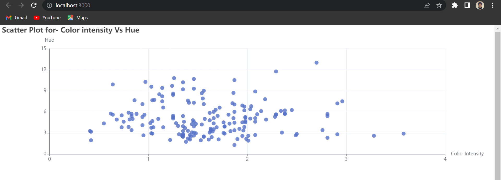
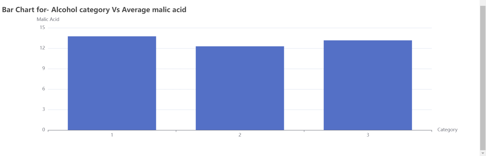

# ManufacChartsAssignment.github.io

My typescript implementation for the ECharts for React assignment given by ManufacAnalytics.

To Run Locally-
-Clone th repo.
-And run the command yarn start.  

